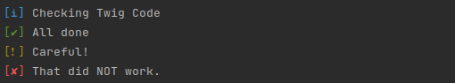

# Script IO: Pretty and minimal bash output

This library helps you write prettier scripts for CI/CD, git hooks, ...

## Installation

You can require the package via composer for PHP projects, or npm/yarn for Browser/Node projects.

```shell
composer require --dev barthy-koeln/bash-echolorized
```

```shell
yarn add -D bash-echolorized
```

## Importing & usage

If this package is required via composer:

```shell
#!/usr/bin/env bash

DIR=$(realpath "$(dirname "${BASH_SOURCE[0]}")")

# if required via composer
source "$DIR/vendor/bin/echolorized"

# if required via yarn/npm
source "$DIR/node_modules/.bin/echolorized"
```

### Basic usage:

```shell
e_info "Checking Twig Code"
e_success "All done"
e_warning "Careful!"
e_error "That did NOT work."
```

Output:



### Advanced usage (git pre-commit example):

```shell
colored_output "$GREEN" "\n[EXECUTING PRE COMMIT HOOK]"
e_info "USE ${YELLOW}git commit -n -m 'your message'${RESET} to bypass these checks."
echo -e ''

e_info "Checking YAML config"

if ! "$DIR/console" --quiet lint:yaml config; then
  e_error "Error in YAML config. Run ${YELLOW}bin/console lint:yaml${RESET} to check.\n"
  exit 1
fi

e_success "All good, staging additional changes.\n"
git update-index --again
```

Output:


